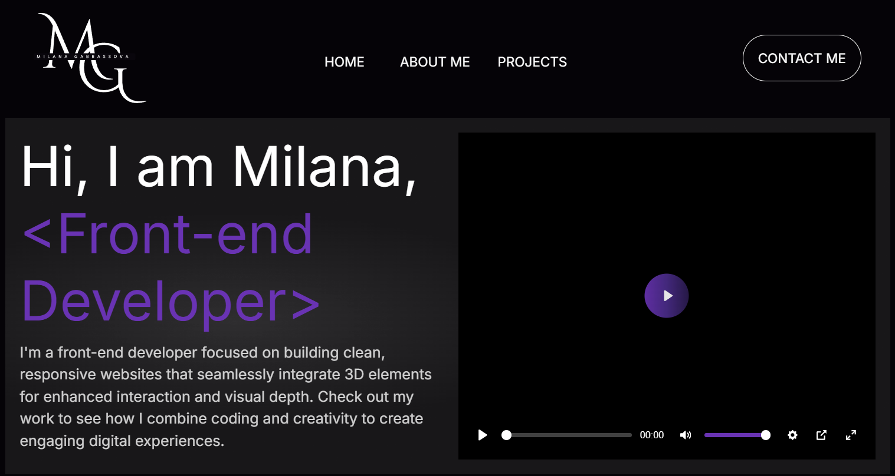

# Milana_Gabbassova_Portfolio

Welcome to my portfolio! This site showcases my work as a front-end developer specializing in sleek, responsive websites with interactive 3D elements. It highlights my expertise in web development and 3D design, featuring selected projects, skills, and contact information.

Explore my journey through case studies, discover my skills in various tools and frameworks, and see how I integrate 3D design into web pages to elevate user experience.

## Installation
This is no installatin required, but should be opened with live server.

## Usage
Open index.html in the browser of your choice.

## Contributing
1. Fork it!
2. Create your feature branch: git checkout -b my-new-feature
3. Commit your changes: git commit -am 'Add some feature'
4. Push to the branch: git push origin my-new-feature
5. Submit a pull request :D

## History
October 25, 2024

## Credits
Milana Gabbassova

## License
MIT License